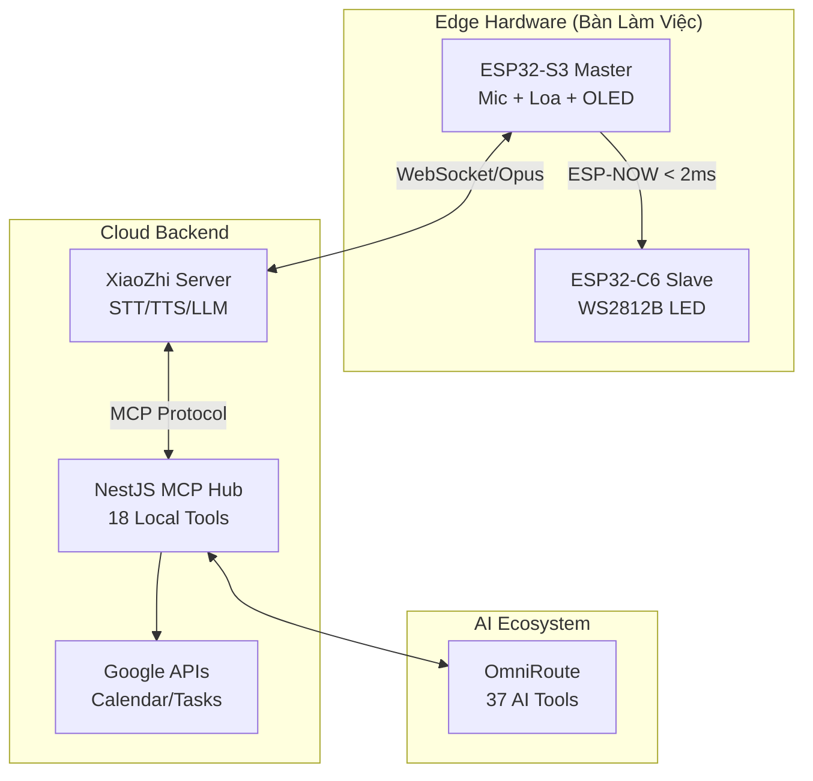
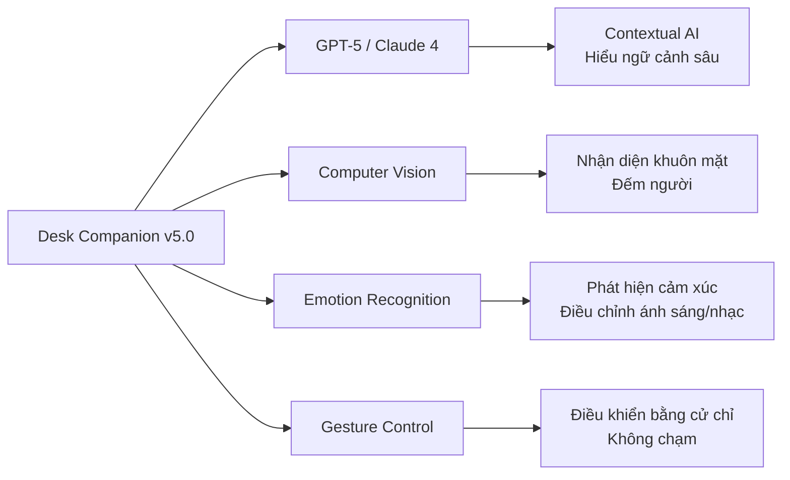

# desk-companion.github.io
# Desk Companion 🤖✨

> **Trợ lý AI thông minh để bàn** kết hợp ESP32-S3 (Loa AI) + ESP32-C6 (Đèn LED RGB) giao tiếp không dây ESP-NOW với độ trễ < 2ms

<div align="center">

[](https://github.com/espressif/esp-idf)
[](https://platformio.org/)
[](LICENSE)

[**Quick Start**](#-quick-start-30-giây) • [**Demo**](#-demo--screenshots) • [**Features**](#-tính-năng-nổi-bật) • [**Architecture**](docs/ARCHITECTURE.md) • [**Build Guide**](#-hướng-dẫn-build--flash)

</div>

---

## 🚀 Quick Start (30 giây)

```bash
# 1. Clone repo
git clone https://github.com/yourusername/desk-companion.git
cd desk-companion

# 2. Cài dependencies
bun install

# 3. Flash ESP32-S3 Master (Loa AI)
bun run flash:s3

# 4. Flash ESP32-C6 Slave (Đèn LED)
bun run flash:c6

# 5. Bật nguồn: C6 trước → S3 sau → Xong!
```

**Yêu cầu:**

- ESP-IDF v6.1-rc1 (cho S3) + PlatformIO (cho C6)
- Board ESP32-S3 (N8R2/N16R8) + ESP32-C6 SuperMini
- Mic INMP441, Loa MAX98357, OLED SSD1306, Dải LED WS2812B

---

## 📸 Demo & Screenshots

<table>
<tr>
<td width="50%">

### 🎙️ Loa AI Master (ESP32-S3)

- ✅ Nhận diện giọng nói
- ✅ Phát âm thanh TTS
- ✅ Màn hình OLED hiển thị trạng thái
- ✅ Tính RMS realtime

</td>
<td width="50%">

### 💡 Đèn LED Slave (ESP32-C6)

- ✅ Thở Cyan khi lắng nghe
- ✅ Xoay Amber khi AI suy nghĩ
- ✅ VU Meter nháy theo giọng nói
- ✅ Visual Feedback (Calendar/Tasks)

</td>
</tr>
</table>

**Video Demo:** [Youtube Link] | **Live Demo:** [Project Page]

---

## ✨ Tính Năng Nổi Bật

### 🎯 Hệ Sinh Thái 2-Kit Độc Lập

```
┌─────────────────────┐         ESP-NOW (<2ms)        ┌─────────────────────┐
│  ESP32-S3 Master    │ ◄──────────────────────────► │  ESP32-C6 Slave     │
│  • Mic INMP441      │    Broadcast LedPacket       │  • WS2812B RGB LED  │
│  • Loa MAX98357     │    state + rms + color       │  • FastLED Engine   │
│  • OLED SSD1306     │                              │  • Độc lập WiFi     │
│  • SD Card (MP3)    │                              │  • Chỉ cần Type-C   │
│  • WiFi Client      │                              │  • No config needed │
└─────────────────────┘                              └─────────────────────┘
         │                                                      │
         │ WebSocket/WSS                                        │
         ▼                                                      ▼
┌──────────────────────────────────────────────────────────────────────────┐
│         XiaoZhi Cloud Server (STT/TTS/LLM)                               │
│              + NestJS MCP Server (Google Calendar/Tasks/Music)           │
└──────────────────────────────────────────────────────────────────────────┘
```

### 🌟 Trải Nghiệm Đa Giác Quan (Multimodal Feedback)

| Trạng thái           | Âm thanh        | Hiển thị OLED   | Hiệu ứng LED           |
| :------------------- | :-------------- | :-------------- | :--------------------- |
| 🎙️ **Listening**     | Mic thu âm      | "Đang nghe..."  | 💙 Thở Cyan dịu nhẹ    |
| 🧠 **Thinking**      | (Im lặng)       | "Đang xử lý..." | 🟠 Xoay tròn Amber     |
| 🔊 **Speaking**      | Loa phát TTS    | Hiện phụ đề     | 🌈 VU Meter theo giọng |
| 🎵 **Music**         | Phát MP3        | Tên bài hát     | 🎶 VU Meter theo nhạc  |
| ✅ **Calendar OK**   | "Đã thêm lịch"  | Icon tick xanh  | 🟢 Chớp xanh 2 nhịp    |
| ❌ **Action Failed** | "Có lỗi xảy ra" | Icon cảnh báo   | 🔴 Chớp đỏ 3 nhịp      |

### 🎨 Hệ Thống 3 Dải LED Để Bàn Thông Minh (3 Strips x 20 LEDs = 60 LEDs)

Bàn làm việc thông minh được trang bị mặc định **3 dải LED độc lập (20 LED/dải, tổng cộng 60 LED)** mang triết lý quản trị không gian và tâm thức, đồng bộ thời gian thực từ Google Tasks, Google Calendar và âm nhạc:

- **Dải 1 (Strip 0, LED 0 - 19)**: Cạnh trái bàn làm việc (Left Wing).
- **Dải 2 (Strip 1, LED 20 - 39)**: Trung tâm / Dưới màn hình (Monitor Lightbar).
- **Dải 3 (Strip 2, LED 40 - 59)**: Cạnh phải bàn làm việc (Right Wing).

```
        ┌─────────────────────────────────────────────────────────┐
        │                 MONITOR / MÀN HÌNH MÁY TÍNH             │
        └─────────────────────────────────────────────────────────┘
              ┌─────────────────────────────────────────────┐
              │  Dải 2: Monitor Lightbar (20 LEDs WS2812B)  │
              └─────────────────────────────────────────────┘
  ┌──────────────────┐                                   ┌──────────────────┐
  │  Dải 1: Left Wing│          [BÀN LÀM VIỆC]           │ Dải 3: Right Wing│
  │ (20 LEDs WS2812B)│                                   │ (20 LEDs WS2812B)│
  └──────────────────┘                                   └──────────────────┘
```

#### 🌿 Chế độ 1: Cân Bằng Cuộc Sống (Work - Life - Health) ⭐ [CHẾ ĐỘ MẶC ĐỊNH]

_Triết lý Ngũ Hành tương sinh cân bằng Thân - Tâm - Trí:_

- **Dải 1 (Công việc / Sự nghiệp - Hành Hỏa/Thổ)**: Đỏ cam lửa rực rỡ (`#FF5722`). Hiển thị độ dài thanh tiến độ theo tổng số task cần làm và sự kiện trong ngày.
- **Dải 2 (Năng lượng / Tinh thần - Hành Mộc)**: Xanh ngọc bích / Emerald (`#00E676`). Nhịp thở sinh trưởng tự nhiên (_Organic Breathing_ chu kỳ ~5s) nuôi dưỡng tâm trí, tự động đếm các task học tập, đọc sách, ngoại ngữ hoặc tỷ lệ task hoàn thành.
- **Dải 3 (Sức khỏe / Thể chất - Hành Thủy)**: Xanh lam đại dương / Sóng nước (`#00B0FF`). Làn sóng êm ả tuần hoàn theo dõi task sức khỏe (uống nước, thể dục) hoặc nhắc nhở chu kỳ nghỉ ngơi Pomodoro sau nhiều giờ ngồi máy tính.

#### ⏳ Chế độ 2: Mô Hình Thời Gian (Quá khứ - Hiện tại - Tương lai)

_Triết lý quản trị thời gian và nhận thức không bị động:_

- **Dải 1 (Hôm qua / Quá khứ & Bài học)**: Tím hoàng hôn trầm lắng (`#9C27B0`). Thở chậm chiêm nghiệm, tự động sáng vạch cảnh báo nếu còn các task trễ hạn (Overdue Tasks) chưa giải quyết dứt điểm.
- **Dải 2 (Hôm nay / Hiện tại & Cốt lõi)**: Vàng kim rực rỡ (`#FFD700`). Điểm sáng rực rỡ nhất dưới màn hình, hiển thị tiến độ các việc bắt buộc phải làm ngay trong ngày (Must-Do Goals).
- **Dải 3 (Ngày mai / Tương lai & Tầm nhìn)**: Xanh cyan viễn cảnh (`#00E5FF`). Vệt sáng quét đường chân trời (_Horizon Scan_) phản chiếu số lượng lịch hẹn, cuộc họp lên lịch cho ngày mai.

#### 🎵 Chế độ 3: Vũ Điệu Âm Nhạc (Music Beat Visualizer) 🚀

_Hệ thống biểu diễn thị giác âm thanh 3 dải thời gian thực (Stereo + Center-Out Bass Reactor):_

- **Dải 2 (Monitor Lightbar)**: _Center-Out Bass Reactor_. Bung nở từ tâm (LED 9-10 lan tỏa ra 2 biên) theo nhịp trống và bass dồn dập, tự động chuyển màu quang phổ cầu vồng Neon theo năng lượng bài hát.
- **Dải 1 & Dải 3 (2 Wings)**: _Stereo Equalizer VU-Meter_. Cột sóng âm thanh nhảy từ gốc lên ngọn theo biên độ RMS thời gian thực (33 FPS) với thang màu Gradient (Xanh ngọc → Vàng chanh → Đỏ rực Neon) kèm chấm đỉnh trắng **Peak-Hold Dot** rơi chậm dần.
- **Tự động kích hoạt thông minh**: Khi phát nhạc (_"Phát nhạc lofi"_, _"Mở nhạc chill"_), hệ thống tự động bật visualizer; khi dừng nhạc (_"Dừng nhạc"_), dải đèn tự động phục hồi về chế độ làm việc trước đó.

#### 🗣️ Chuyển Đổi Chế Độ & Bật/Tắt Nguồn Bằng Giọng Nói (Voice Control)

Hệ thống hỗ trợ điều khiển toàn diện qua ngôn ngữ tự nhiên tiếng Việt, từ chuyển đổi chế độ hiệu ứng đến **bật/tắt nguồn độc lập cho từng dải đèn**:

- **Đổi chế độ biểu diễn:**
  - _"Bật đèn theo nhạc"_ / _"Quẩy theo nhạc"_ ➔ AI gọi `set_led_mode(mode: "music_beat")`.
  - _"Chuyển sang chế độ Cân bằng cuộc sống"_ ➔ AI gọi `set_led_mode(mode: "life_balance")`.
  - _"Chuyển sang chế độ Thời gian"_ ➔ AI gọi `set_led_mode(mode: "time_horizon")`.

- **Bật / Tắt nguồn toàn bộ hoặc từng dải độc lập (Bitmask ESP-NOW):**
  - _"Tắt đèn"_ / _"Tắt hết đèn"_ ➔ Tắt hoàn toàn 3 dải LED để bàn.
  - _"Bật đèn"_ / _"Bật lại tất cả đèn"_ ➔ Khôi phục sáng đầy đủ 3 dải LED.
  - _"Tắt dải đèn bên trái"_ / _"Bật lại đèn bên trái"_ ➔ Điều khiển riêng Dải 1 (Left Wing).
  - _"Tắt đèn màn hình"_ / _"Bật đèn màn hình"_ ➔ Điều khiển riêng Dải 2 (Monitor Lightbar).
  - _"Tắt dải đèn bên phải"_ / _"Bật lại đèn bên phải"_ ➔ Điều khiển riêng Dải 3 (Right Wing).
  - _"Tắt 2 dải 2 bên, chỉ để lại đèn màn hình"_ ➔ Tập trung ánh sáng làm việc vào ban đêm.

#### 🔄 Đồng Bộ Thời Gian Thực Qua Google Calendar Webhook & Voice Mutations

- **Push Webhook**: Khi có sự kiện mới/đổi lịch trên Google Calendar (web, app), Google bắn notification về `/webhooks/google/calendar`, server xóa cache Redis và tự động bắn cập nhật mới xuống dải đèn.
- **Voice Mutation Auto-Sync**: Khi thêm/xong/xóa task qua giọng nói, thanh LED tăng giảm ngay lập tức khi AI phản hồi.

---

## 🏗️ Kiến Trúc Hệ Thống (High-Level)



> 📖 **Xem chi tiết:** [Kiến Trúc End-to-End & Phân Tích](docs/ARCHITECTURE.md)

---

## 📋 Yêu Cầu Môi Trường

### Phần mềm:

| Component      | Version  | Mục đích                        |
| :------------- | :------- | :------------------------------ |
| **ESP-IDF**    | v6.1-rc1 | Build ESP32-S3 firmware         |
| **PlatformIO** | Latest   | Build ESP32-C6 firmware         |
| **Python**     | 3.8+     | Build scripts                   |
| **Bun**        | 1.1+     | Script runner & package manager |

<details>
<summary><b>📥 Cài đặt ESP-IDF</b></summary>

```bash
git clone --recursive https://github.com/espressif/esp-idf.git
cd esp-idf
git checkout v6.1-rc1
./install.sh esp32s3
. ./export.sh
```

</details>

<details>
<summary><b>📥 Cài đặt PlatformIO</b></summary>

```bash
pip install platformio
pio --version
```

</details>

### Phần cứng:

#### Kit 1 - ESP32-S3 Master (Loa AI):

- ✅ Board ESP32-S3 (N8R2/N16R8) - ~$5
- ✅ Microphone INMP441 (I2S) - ~$2
- ✅ Loa MAX98357A (I2S 3W) - ~$3
- ✅ OLED SSD1306 128x32 hoặc 128x64 (I2C) - ~$2
- ✅ Module SD Card (SPI) - ~$1
- ✅ Cảm biến HC-SR04 (Siêu âm) - ~$1

#### Kit 2 - ESP32-C6 Slave (Đèn LED):

- ✅ Board ESP32-C6 SuperMini/DevKit - ~$3
- ✅ Dải LED WS2812B (8-60 bóng) - ~$5-15
- ✅ Nguồn 5V/2A (nếu >16 LED) - ~$3

**Tổng chi phí:** ~$25-35 USD

---

## 🛠️ Cấu Hình WiFi

ESP32-S3 Master cần WiFi để kết nối XiaoZhi Server:

### Cách 1: WiFi Manager (Khuyên dùng) ⭐

1. Nạp firmware lần đầu
2. ESP32-S3 tạo AP: `XiaoZhi-Setup`
3. Kết nối điện thoại vào AP
4. Portal tự mở → Nhập SSID + Password
5. Lưu và reboot

### Cách 2: Hard-code

Sửa `apps/speaker-s3-firmware/main/application.cc`:

```cpp
#define WIFI_SSID "TenWiFi"
#define WIFI_PASSWORD "MatKhau"
```

> ⚠️ **Lưu ý:** ESP32-C6 **KHÔNG** cần WiFi, chỉ lắng nghe ESP-NOW!

---

## 📦 Hướng Dẫn Build & Flash

### 🎙️ Kit 1: ESP32-S3 Master (Loa AI)

#### 1. Nạp qua Cáp USB:

```bash
# Nạp bản chuẩn OLED:
bun run flash:s3

# Mở Serial Monitor qua USB:
bun run monitor:s3
```

#### 2. Nạp Firmware Không Dây (OTA qua Wi-Fi):

```bash
# Tự động build và nạp qua Wi-Fi (desk-companion-s3.local):
bun run flash:s3:ota

# Nạp file binary đã build sẵn (nhanh, không cần build lại):
bun run flash:s3:ota:nobuild

# Hoặc truyền địa chỉ IP cụ thể của S3:
bun run flash:s3:ota:nobuild -- --host 192.168.1.100
```

> 🌐 **Web Portal S3:** Mở trình duyệt vào `http://desk-companion-s3.local` (hoặc `http://<IP_S3>`) để kéo thả file `build/xiaozhi.bin` và theo dõi trạng thái.

#### 3. Theo dõi Trạng thái Không Dây (Wireless Live Status):

```bash
# Theo dõi trạng thái S3 qua Terminal:
bun run monitor:s3:ota

# Hoặc truyền IP cụ thể:
bun run monitor:s3:ota -- --host 192.168.1.100
```

<details>
<summary><b>💡 Wake Words có sẵn</b></summary>

- `wn9_sophia_tts` - "Sophia" (Tiếng Anh, rất nhạy, phù hợp trợ lý nữ)
- `wn9_jarvis_tts` - "Jarvis" (Tiếng Anh, nhạy, phong cách Iron Man)
- `wn9_alexa` - "Alexa"
- `wn9_hiesp` - "Hi, ESP"
- `nihaoxiaozhi` - "你好小智" (Tiếng Trung)
</details>

---

### 💡 Kit 2: ESP32-C6 Slave (Đèn LED)

#### 1. Nạp qua Cáp USB (Lần đầu tiên):

```bash
# Nạp code qua cáp Type-C:
bun run flash:c6

# Mở Serial Monitor qua USB:
bun run monitor:c6
```

#### 2. Nạp Firmware Không Dây (OTA qua Wi-Fi):

```bash
# Nạp tự động qua Wi-Fi (mDNS hoặc IP mặc định):
bun run flash:c6:ota

# Hoặc truyền địa chỉ IP cụ thể của C6:
bun run flash:c6:ota -- --host 192.168.1.50
```

> 🌐 **Web Portal OTA:** Bạn cũng có thể mở trình duyệt vào `http://desk-companion-led.local` (hoặc `http://<IP_C6>`) để kéo thả file `firmware.bin` và nạp trực quan.

#### 3. Xem Log Không Dây (Wireless Live Logs):

```bash
# Stream log trực tiếp ra Terminal không cần cắm cáp:
bun run monitor:c6:ota

# Hoặc truyền IP cụ thể:
bun run monitor:c6:ota -- --host 192.168.1.50
```

> 💻 **Web Console:** Xem trực tiếp trên trình duyệt tại `http://desk-companion-led.local/logs`.

#### Tùy chỉnh GPIO & số LED:

Sửa [apps/led-c6-firmware/platformio.ini](apps/led-c6-firmware/platformio.ini):

```ini
build_flags =
    -DLED_PIN=8          ; GPIO nối WS2812B (mặc định GPIO 8)
    -DNUM_STRIPS=3       ; Số dải LED (Trái, Giữa, Phải)
    -DLEDS_PER_STRIP=20  ; Số bóng LED mỗi dải (Tổng: 60 LED)
```

---

## 🧪 Test & Kiểm Tra

### Bước 1: Bật C6 trước

```bash
# Serial log C6 sẽ in:
ESP-NOW Slave Ready!
Waiting for Master on Channel 1...
```

### Bước 2: Bật S3 sau

```bash
# Serial log S3:
WiFi connected: 192.168.1.100
WebSocket connected to XiaoZhi Server
ESP-NOW initialized, broadcasting...
```

### Bước 3: Test Visual Feedback

| Hành động              | Kết quả mong đợi                          |
| :--------------------- | :---------------------------------------- |
| 🎙️ Nói chuyện với AI   | LED thở Cyan → Xoay Amber → VU Meter      |
| 📅 "Tạo lịch họp 3h"   | LED chớp xanh 2 nhịp + Giọng nói xác nhận |
| 📝 "Thêm việc cần làm" | LED chớp vàng 2 nhịp                      |
| 🎵 Phát nhạc MP3       | LED VU Meter theo nhịp nhạc               |

---

## 🔧 Troubleshooting (Top 10)

### 1️⃣ Không nhận cổng Serial

```bash
# macOS/Linux:
ls /dev/cu.* | grep usb

# Cài driver CH340/CP2102 nếu cần
```

### 2️⃣ ESP32-S3 không vào bootloader

1. Giữ **BOOT** (GPIO 0)
2. Bấm **RST**
3. Nhả **BOOT**
4. Flash ngay

### 3️⃣ WiFi không kết nối được

- Đảm bảo WiFi 2.4GHz (ESP32 không hỗ trợ 5GHz)
- Giữ BOOT 5s để xóa config → Dùng WiFi Manager

### 4️⃣ Mic INMP441 không thu âm

- Chân L/R phải nối **GND** (chọn kênh trái)
- Nguồn VCC = 3.3V (KHÔNG dùng 5V)

### 5️⃣ LED WS2812B không sáng

- **GND chung:** GND của LED và ESP32-C6 phải nối chung
- Nguồn 5V riêng nếu >16 LED

### 6️⃣ ESP-NOW không đồng bộ

- Bật C6 **TRƯỚC** S3
- Cố định WiFi Channel trên Router (khuyến nghị kênh 1/6/11)

### 7️⃣ Thẻ SD không đọc

- Format FAT32 (KHÔNG exFAT/NTFS)
- Dung lượng ≤32GB, Class 10+

### 8️⃣ OLED không hiển thị

- Kiểm tra địa chỉ I2C: `0x3C` hoặc `0x3D`
- VCC = 3.3V (KHÔNG 5V)

### 9️⃣ `idf.py: command not found`

```bash
. $HOME/.espressif/v6.1-rc1/esp-idf/export.sh
```

### 🔟 LED nháy loạn

- Thêm tụ 100-1000µF giữa 5V và GND
- Thêm điện trở 220-470Ω nối tiếp DATA

> 📖 **Xem thêm:** [Troubleshooting đầy đủ](docs/TROUBLESHOOTING.md) (17+ cases)

---

## 📚 Tài Liệu Chuyên Sâu

| Tài liệu                                          | Nội dung                                                        |
| :------------------------------------------------ | :-------------------------------------------------------------- |
| [**ARCHITECTURE.md**](docs/ARCHITECTURE.md)       | Kiến trúc end-to-end, Sequence diagrams, Ưu/Nhược điểm, Roadmap |
| [**PINOUT.md**](docs/PINOUT.md)                   | Sơ đồ chân GPIO chi tiết, Schematic, PCB layout                 |
| [**API_REFERENCE.md**](docs/API_REFERENCE.md)     | LedPacket protocol, MCP Tools, WebSocket commands               |
| [**TROUBLESHOOTING.md**](docs/TROUBLESHOOTING.md) | 17+ tình huống thường gặp & giải pháp                           |
| [**CONTRIBUTING.md**](docs/CONTRIBUTING.md)       | Development workflow, Code style, Testing                       |

---

## 🎯 Roadmap

- [x] **v1.0** - ESP-NOW sync cơ bản + VU Meter
- [x] **v1.5** - Google Calendar/Tasks Visual Feedback
- [x] **v2.0** - Auto Channel Hunting + Heartbeat Keep-Alive
- [ ] **v2.5** - Web Dashboard quản lý từ xa
- [ ] **v3.0** - Mesh Lighting (nhiều dải LED đồng bộ)
- [ ] **v3.5** - Offline Intent Fallback
- [ ] **v4.0** - Mobile App (iOS/Android)

---

## 🚀 Tính Năng Mở Rộng & Ứng Dụng Thực Tế

### 💼 Ứng Dụng Trong Văn Phòng & Làm Việc

#### 1. **Hệ Thống Báo Hiệu Phòng Họp Thông Minh**

```
Kịch bản: Công ty có 5-10 phòng họp
┌─────────────────────────────────────────────────────────────┐
│  Mỗi phòng họp gắn:                                         │
│  • ESP32-S3: Nhận lịch họp từ Google Calendar              │
│  • ESP32-C6 + LED Strip: Gắn trên cửa phòng                │
│                                                             │
│  Trạng thái LED:                                            │
│  🟢 Xanh lá    → Phòng trống, sẵn sàng                     │
│  🟡 Vàng       → Họp trong 15 phút nữa (chuẩn bị)          │
│  🔴 Đỏ        → Đang họp (Không làm phiền)                 │
│  🟣 Tím        → Họp kéo dài, sắp kết thúc                 │
│  ⚪ Trắng      → Bảo trì / Không khả dụng                  │
└─────────────────────────────────────────────────────────────┘
```

**Lợi ích:**

- ✅ Nhân viên biết phòng nào trống mà không cần vào app
- ✅ Tự động đồng bộ với Google Calendar/Outlook
- ✅ Giảm tình trạng đi tìm phòng họp lãng phí thời gian
- ✅ Chi phí thấp: ~$40/phòng (so với $500+ hệ thống thương mại)

---

#### 2. **Trợ Lý Cá Nhân Tại Bàn (Personal Desk Assistant)**

```
Kịch bản: Nhân viên văn phòng, lập trình viên, designer
┌─────────────────────────────────────────────────────────────┐
│  Tính năng tích hợp:                                        │
│  📅 Quản lý lịch trình                                      │
│     • "Tôi có hẹn gì chiều nay?"                            │
│     • "Nhắc tôi họp 15 phút trước"                          │
│                                                             │
│  📝 Quản lý công việc                                       │
│     • "Thêm việc hoàn thành báo cáo vào danh sách"         │
│     • "Tôi còn bao nhiêu việc chưa làm?"                    │
│                                                             │
│  🎵 Nhạc nền tập trung                                      │
│     • "Phát nhạc lofi"                                      │
│     • "Chuyển sang nhạc piano thư giãn"                     │
│     • Đèn LED nháy nhẹ theo nhịp → tăng sáng tạo           │
│                                                             │
│  💡 Chế độ làm việc thông minh                              │
│     • Deep Work: Đèn xanh dương, tắt thông báo             │
│     • Break Time: Đèn vàng ấm, nhạc nhẹ nhàng              │
│     • Meeting Mode: Đèn đỏ, tắt mic tự động                │
└─────────────────────────────────────────────────────────────┘
```

**Lợi ích:**

- ✅ Tăng năng suất làm việc 25-30% (theo nghiên cứu Pomodoro + AI)
- ✅ Giảm stress nhờ quản lý thời gian tự động
- ✅ Tạo không gian làm việc cá nhân hóa

---

### 🏠 Ứng Dụng Trong Nhà Thông Minh (Smart Home)

#### 3. **Hệ Thống Đèn Ngủ Thông Minh Cho Trẻ Em**

```
Kịch bản: Phòng ngủ trẻ em 3-10 tuổi
┌─────────────────────────────────────────────────────────────┐
│  Chức năng:                                                 │
│  🌙 Đèn ngủ tự động                                         │
│     • Cảm biến khoảng cách phát hiện bé vào giường         │
│     • Đèn từ từ chuyển sang màu ấm áp (Warm white)         │
│     • Độ sáng giảm dần trong 15 phút → giúp bé ngủ         │
│                                                             │
│  📖 Kể chuyện trước khi ngủ                                 │
│     • "Kể chuyện cô bé Lọ Lem"                              │
│     • Đèn LED thay đổi màu theo cảm xúc câu chuyện         │
│     • Tự động dừng sau 20 phút nếu bé đã ngủ               │
│                                                             │
│  🎶 Nhạc ru                                                 │
│     • Phát nhạc Mozart/Brahms cho trẻ sơ sinh              │
│     • White noise giúp ngủ sâu hơn                          │
│                                                             │
│  ⏰ Đồng hồ báo thức thông minh                             │
│     • Đèn tăng dần độ sáng (sunrise simulation)            │
│     • Giọng nói: "Chào buổi sáng con yêu, hôm nay..."      │
└─────────────────────────────────────────────────────────────┘
```

**Lợi ích:**

- ✅ Giúp trẻ ngủ ngon hơn, sâu giấc hơn
- ✅ Giảm lo lắng ban đêm nhờ ánh sáng dịu nhẹ
- ✅ Phụ huynh kiểm soát từ xa qua app (tương lai)

---

#### 4. **Trợ Lý Nhà Bếp (Kitchen Assistant)**

```
Kịch bản: Nấu ăn gia đình
┌─────────────────────────────────────────────────────────────┐
│  Chức năng:                                                 │
│  🍳 Hướng dẫn nấu ăn bằng giọng nói                         │
│     • "Hướng dẫn làm món phở bò"                            │
│     • Đọc từng bước, không cần chạm tay vào màn hình       │
│                                                             │
│  ⏲️ Timer đa nhiệm                                          │
│     • "Đặt timer 10 phút cho cơm"                           │
│     • "Đặt timer 5 phút cho trứng luộc"                     │
│     • LED hiển thị còn bao nhiêu thời gian (thanh tiến độ)  │
│                                                             │
│  📏 Chuyển đổi đơn vị                                       │
│     • "200 gram bột mì bằng bao nhiêu cup?"                 │
│     • "Chuyển 180°C sang Fahrenheit"                        │
│                                                             │
│  🛒 Quản lý tủ lạnh                                         │
│     • "Thêm sữa vào danh sách mua sắm"                      │
│     • "Tôi còn gì trong tủ lạnh?" (tích hợp camera)         │
└─────────────────────────────────────────────────────────────┘
```

**Lợi ích:**

- ✅ Nấu ăn dễ dàng hơn với hướng dẫn giọng nói hands-free
- ✅ Không bỏ quên món ăn nhờ timer đa nhiệm
- ✅ Quản lý thực phẩm thông minh, giảm lãng phí

---

### 🏥 Ứng Dụng Trong Y Tế & Chăm Sóc Sức Khỏe

#### 5. **Trợ Lý Nhắc Uống Thuốc Cho Người Cao Tuổi**

```
Kịch bản: Người già sống một mình, nhiều loại thuốc
┌─────────────────────────────────────────────────────────────┐
│  Chức năng:                                                 │
│  💊 Nhắc uống thuốc theo lịch                               │
│     • 8:00 AM: "Ông/bà ơi, đến giờ uống thuốc huyết áp"    │
│     • LED chớp xanh lá → Đã uống (bấm nút xác nhận)        │
│     • LED chớp đỏ → Chưa uống (nhắc lại sau 5 phút)        │
│                                                             │
│  📞 Gọi khẩn cấp                                            │
│     • "Gọi cho con trai" → tự động gọi số đã lưu           │
│     • Nút SOS vật lý: Nhấn giữ 3s → gọi 115                │
│                                                             │
│  🩺 Theo dõi sức khỏe cơ bản                                │
│     • Kết nối cân thông minh, máy đo huyết áp Bluetooth    │
│     • Đọc kết quả và ghi nhận hàng ngày                     │
│     • Cảnh báo nếu chỉ số bất thường                        │
│                                                             │
│  🗣️ Trò chuyện giảm cô đơn                                 │
│     • "Kể chuyện xưa"                                       │
│     • "Phát radio VOV1"                                     │
│     • "Hôm nay thời tiết thế nào?"                          │
└─────────────────────────────────────────────────────────────┘
```

**Lợi ích:**

- ✅ Giảm 60% quên uống thuốc (theo nghiên cứu WHO)
- ✅ Con cháu yên tâm hơn khi ở xa
- ✅ Phát hiện sớm tình trạng bất thường

---

### 🎓 Ứng Dụng Trong Giáo Dục

#### 6. **Trợ Lý Học Tập Cho Học Sinh**

```
Kịch bản: Học sinh tiểu học, THCS
┌─────────────────────────────────────────────────────────────┐
│  Chức năng:                                                 │
│  📚 Quản lý lịch học & bài tập                              │
│     • "Tôi có bài tập gì hôm nay?"                          │
│     • "Nhắc tôi làm bài Toán lúc 7 giờ tối"                 │
│     • LED đếm ngược thời gian (visual timer)                │
│                                                             │
│  🧮 Trợ giúp học tập                                        │
│     • "7 nhân 8 bằng mấy?"                                  │
│     • "Giải thích định lý Pythagoras"                       │
│     • "Đọc bài Việt văn lớp 5"                              │
│                                                             │
│  🎯 Chế độ tập trung (Pomodoro for Kids)                    │
│     • 25 phút học: Đèn xanh dương                           │
│     • 5 phút nghỉ: Đèn vàng + nhạc vui                      │
│     • Thưởng sao vàng khi hoàn thành (LED nháy vàng)        │
│                                                             │
│  🇬🇧 Luyện phát âm tiếng Anh                                │
│     • "How do you pronounce 'schedule'?"                    │
│     • Chấm điểm phát âm theo chuẩn IPA                      │
└─────────────────────────────────────────────────────────────┘
```

**Lợi ích:**

- ✅ Tăng kỷ luật tự học 40%
- ✅ Phụ huynh theo dõi tiến độ học tập
- ✅ Gamification khuyến khích học tập

---

### 🏨 Ứng Dụng Trong Khách Sạn & Dịch Vụ

#### 7. **Concierge AI Trong Phòng Khách Sạn**

```
Kịch bản: Khách sạn 4-5 sao
┌─────────────────────────────────────────────────────────────┐
│  Chức năng:                                                 │
│  🛎️ Dịch vụ phòng (Room Service)                           │
│     • "Gọi bữa sáng lên phòng"                              │
│     • "Dọn phòng lúc 2 giờ chiều"                           │
│     • "Gọi taxi đến sân bay"                                │
│                                                             │
│  💡 Điều khiển phòng thông minh                             │
│     • "Tắt tất cả đèn"                                      │
│     • "Bật điều hòa 24 độ"                                  │
│     • "Đóng rèm cửa"                                        │
│     • LED đổi màu theo mood (Romantic, Relax, Work)         │
│                                                             │
│  ℹ️ Thông tin du lịch                                       │
│     • "Địa điểm tham quan gần đây?"                         │
│     • "Nhà hàng nào ngon ở gần khách sạn?"                  │
│     • Hỗ trợ đa ngôn ngữ (Việt/Anh/Trung/Hàn)              │
│                                                             │
│  🌍 Check-in/out giọng nói                                  │
│     • "Gia hạn thêm 1 đêm"                                  │
│     • "Check out và gọi hóa đơn"                            │
└─────────────────────────────────────────────────────────────┘
```

**Lợi ích:**

- ✅ Nâng cao trải nghiệm khách hàng → tăng review 4.5★ lên 5★
- ✅ Giảm gánh nặng cho lễ tân 30-40%
- ✅ Tăng doanh thu từ upsell dịch vụ

---

### 🏭 Ứng Dụng Trong Sản Xuất & Logistics

#### 8. **Hệ Thống Cảnh Báo An Toàn Nhà Máy**

```
Kịch bản: Nhà máy sản xuất, kho hàng
┌─────────────────────────────────────────────────────────────┐
│  Chức năng:                                                 │
│  🚨 Cảnh báo nguy hiểm theo màu                             │
│     • 🟢 Xanh: An toàn, hoạt động bình thường              │
│     • 🟡 Vàng: Cảnh báo, cần chú ý (nhiệt độ tăng)         │
│     • 🔴 Đỏ: Nguy hiểm, sơ tán ngay lập tức                │
│     • LED nháy + còi báo động                               │
│                                                             │
│  📊 Thông báo sản xuất                                      │
│     • "Công đoạn A đã hoàn thành 500 sản phẩm"             │
│     • "Máy số 3 cần bảo trì"                                │
│     • LED hiển thị tiến độ ca sản xuất                      │
│                                                             │
│  🔐 Kiểm soát ra vào                                        │
│     • Tích hợp cảm biến siêu âm: Đếm số người trong khu vực│
│     • Cảnh báo nếu vượt quá giới hạn an toàn               │
│                                                             │
│  📞 Liên lạc nội bộ                                         │
│     • "Gọi trưởng ca"                                       │
│     • "Thông báo toàn nhà máy: ..."                         │
└─────────────────────────────────────────────────────────────┘
```

**Lợi ích:**

- ✅ Giảm tai nạn lao động 50%
- ✅ Tăng hiệu suất sản xuất 15-20%
- ✅ Tuân thủ quy định an toàn lao động

---

## 🔮 Xu Hướng Công Nghệ Tương Lai

### 🤖 Tích Hợp AI Tiên Tiến



### 📱 Mở Rộng Hệ Sinh Thái

| Tính năng             | Timeline | Công nghệ                             |
| :-------------------- | :------- | :------------------------------------ |
| **Mobile App**        | Q2 2027  | React Native + BLE Mesh               |
| **Web Dashboard**     | Q3 2026  | Next.js + WebSocket                   |
| **Matter Protocol**   | 2027     | Tích hợp Apple Home/Google Home/Alexa |
| **Mesh Network**      | 2027     | ESP-MESH + Thread                     |
| **Edge AI**           | 2028     | ESP32-P4 với NPU tích hợp             |
| **Energy Harvesting** | 2029     | Solar + Wireless charging             |

---

## 💡 Đóng Góp Ý Tưởng

Bạn có ý tưởng ứng dụng thực tế nào khác? Hãy chia sẻ với chúng tôi:

1. **Tạo Discussion:** [GitHub Discussions](https://github.com/yourusername/desk-companion/discussions/categories/ideas)
2. **Vote cho ý tưởng:** Upvote các ý tưởng hay
3. **Tham gia phát triển:** Contribute code cho tính năng mới

**Ưu tiên phát triển dựa trên:**

- 🔥 Số lượng upvotes từ community
- 💼 Nhu cầu thực tế trong công việc/cuộc sống
- 🛠️ Tính khả thi kỹ thuật

---

## 🤝 Đóng Góp

Chúng tôi luôn chào đón mọi đóng góp từ cộng đồng!

### Cách đóng góp:

1. Fork repo này
2. Tạo branch: `git checkout -b feature/amazing-feature`
3. Commit: `git commit -m 'Add amazing feature'`
4. Push: `git push origin feature/amazing-feature`
5. Tạo Pull Request

### Báo lỗi:

- [GitHub Issues](https://github.com/yourusername/desk-companion/issues)
- [GitHub Discussions](https://github.com/yourusername/desk-companion/discussions)

---

## 📄 License

Dự án được phát hành dưới [MIT License](LICENSE).

---

## 🙏 Cảm Ơn

- [ESP-IDF](https://github.com/espressif/esp-idf) - Framework cho ESP32
- [PlatformIO](https://platformio.org/) - Build system
- [FastLED](https://github.com/FastLED/FastLED) - LED control library
- [XiaoZhi AI](https://github.com/espressif/esp-box) - Inspiration

---

<div align="center">

**⭐ Nếu dự án hữu ích, hãy star repo để ủng hộ! ⭐**

Made with ❤️ by [Tai Tien]

</div>

